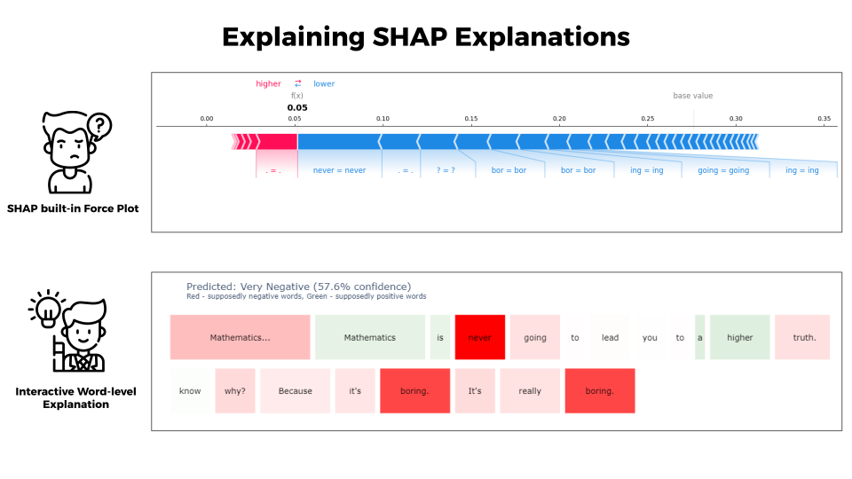
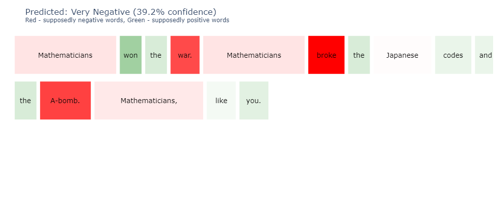
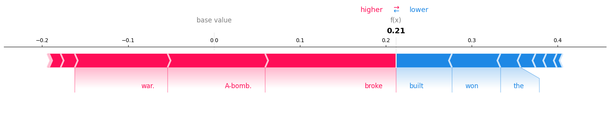

# Explaining the explanations: SHAP Multilingual Sentiment Analysis

[](https://colab.research.google.com/drive/1f7lvv7RuGWDW1p3ssn4gAG5c62eEJuPB?usp=sharing)


This project implements multilingual sentiment classification analysis using SHAP (SHapley Additive exPlanations) for model interpretability. It analyzes sentiment in parallel texts across multiple languages (English, Russian, and Italian) and provides detailed visualizations of how each **word** contributes to the sentiment predictions.



## Features

- Multilingual sentiment analysis using DistilBERT-based model
- SHAP-based model interpretation
- Custom and built-in SHAP visualizations
- Support for parallel multillingual text analysis
- Word-level contribution analysis
- Interactive visualizations using Plotly

Originally created on: Windows 11 (64-bit), NVIDIA GeForce RTX 4060, VS Code

## Installation

1. Clone the repository:
```bash
git clone https://github.com/tim-toothed/multilingual-sentiment-SHAP.git
cd SHAP_project
```

2. Create and activate a virtual environment:
```bash
python -m venv .venv
# On Windows:
.venv\Scripts\activate
# On Unix or MacOS:
source .venv/bin/activate
```

3. Install the required packages:
```bash
pip install -r requirements.txt
```

## Sentiment Analsys Model

Distilbert-based Multilingual Sentiment Classification Model ["tabularisai/multilingual-sentiment-analysis"](https://huggingface.co/tabularisai/multilingual-sentiment-analysis) is used.  
`Task:` Text Classification (Sentiment Analysis)  
`Languages:` Supports English plus Chinese (中文), Spanish (Español), Hindi (हिन्दी), Arabic (العربية), Bengali (বাংলা), Portuguese (Português), Russian (Русский), Japanese (日本語), German (Deutsch), Malay (Bahasa Melayu), Telugu (తెలుగు), Vietnamese (Tiếng Việt), Korean (한국어), French (Français), Turkish (Türkçe), Italian (Italiano), Polish (Polski), Ukrainian (Українська), Tagalog, Dutch (Nederlands), Swiss German (Schweizerdeutsch).  
`Number of Classes:` 5 (Very Negative, Negative, Neutral, Positive, Very Positive)  

## Data Format

The project include two datasets:

1. `movie.csv` - Movie parallel subtitles dataset with columns:
   - id
   - english
   - russian
   - italian

Custom dataset is created on the basis of [ParTree - Parallel Treebanks: A multilingual corpus of movie subtitles](https://www.swissubase.ch/en/catalogue/studies/20295/latest/datasets/2253/2582/overview). 

2. `ai_act.csv` - Legal text dataset with columns:
   - id
   - article (№ of article in original document)
   - english
   - italian

Custom dataset is created on the basis of official AI Act documents in Italian and English [available on EUR-LEX](https://eur-lex.europa.eu/legal-content/EN/TXT/?uri=CELEX%3A32024R1689). 

## Usage

1. Open the Jupyter notebook:
```bash
jupyter notebook shap_clean.ipynb
```

2. Run the cells in sequence to:
   - Load and process the datasets
   - Generate classic token-level SHAP explanations
   - Highlight one, the most confident, class for future explanation
   - Generate word-level SHAP explanations
   - Create visualizations

## Visualizations

The project provides two types of visualizations:

1. Custom Interactive Visualization (Plotly-based)
   - Color-coded word importance
   - Interactive tooltips
   - Sentiment-specific coloring



2. SHAP Force Plot
   - Shows cumulative feature impact
   - Base value to prediction flow



## Output Files

- `shap_clean.ipynb`: main Jupiter Notebook file with code
- `movie.csv`: original dataset with 25 text chunks of parallel movie subtitles on EN-RU-IT
- `ai_act.csv`: original dataset with 25 text chunks from AI Act on EN-IT
- `simple_movie.json`: Processed movie subtitle analysis
- `simple_legal.json`: Processed legal text analysis
- `shap_logs/`: Directory containing detailed processing logs (from tokens to words)

## Notes

- CUDA support is recommended for optimal performance
- Sentiment **Classification** model ["tabularisai/multilingual-sentiment-analysis"](https://huggingface.co/tabularisai/multilingual-sentiment-analysis) is used

## License

[MIT License](LICENSE)

## Authors of the Research
Timur Sharifullin, Francesco Chialli  
WU Digital Economy 2025
